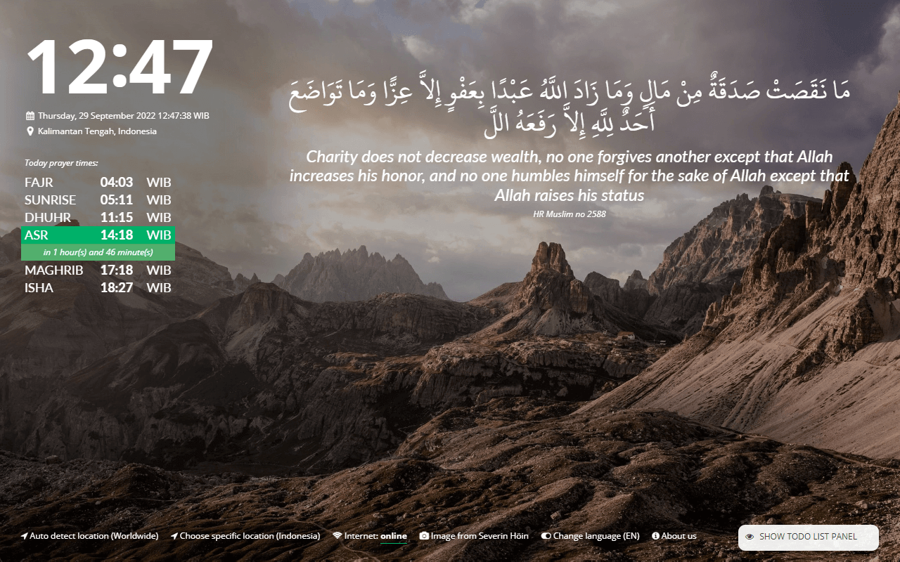

# Muslim Board

Personal Dashboard for Muslims anywhere in the world, available on many languages.

## Supported languages

- English language
- Bahasa Indonesia
- Russian
- Arabic
- Traditional Chinese
- Simplified Chinese
- Hindi
- Bengali

## Preview

## Installation via Official Page

- MacOS **Safari** via [App Store](https://apps.apple.com/us/app/muslim-board/id1659445206)
- Google **Chrome** & **Opera** Browser via official [Chrome Web Store](https://chrome.google.com/webstore/detail/muslim-board/lmnhjilamobdmdihfkofgiejgokabfad) 
- Microsoft **Edge** via official [Edge Add-ons Marketplace](https://microsoftedge.microsoft.com/addons/detail/muslim-board/dfmgmbngjpmbbpgibmdfegilbfckkgli)
- Mozilla **Firefox** via official [Firefox Add-ons Marketplace](https://addons.mozilla.org/en-US/firefox/addon/muslimboard/)

## Local Installation

Use chrome → open up extension menu → click **Load unpacked** and navigate to the `extension` directory. Other browser has similar way to load unpacked extensions.

## Project Structure

- Folder `extension` is where the chrome extension source code lies.
- Folder `macos` is the MacOS safari extension project directory. It is used for maintaining AppStore submission.
- Folder `resources` contains a few resource files (it's used by the extension or website directly).
- Folder `webservices` contains the backend webservice API code.
- Folder `website` contains the source code web/landing page, https://muslimboard.novalagung.com.

## Lisensi dan Status FOSSA

Muslim Board gratis untuk disebarluaskan secara bebas dibawah lisensi MIT License.

## Hall of Fame Contributor

- [A B M Noushad Bhuiyan](https://www.linkedin.com/in/a-b-m-noushad-bhuiyan-166449122) (adding Hindi & Bengali localizations)
- [Eky Pradhana](https://www.linkedin.com/in/eky-pradhana-a7aa6143)
- [Elena Dobrolyubova](https://github.com/eid23) (adding Russian localization)
- [Ferdina Kusumah](https://github.com/FerdinaKusumah)
- [Moch. Sudharmono](https://github.com/moch-sudharmono) (adding Hijri calendar)
- [Mohammed Ayman](https://github.com/MohammedAyman2018) (adding Arabic localization)
- [Muhammad Ichsanul Fadhil](https://github.com/ichsanputr)
- [Radhi Fadlillah](https://github.com/RadhiFadlillah) (making go-prayer lib)
- [Rahadian Ardya](https://www.linkedin.com/in/rahadianardya) (adding remaining time info)
- [Rochmad Nurul Fahmi](https://github.com/rochmadnf)
- [Rosdyana Kusuma](https://github.com/rosdyana) (adding Traditional Chinese localization)
- [王艺凯](https://github.com/redundan3y) (adding Simplified Chinese localization)

## Author

Noval Agung Prayogo
