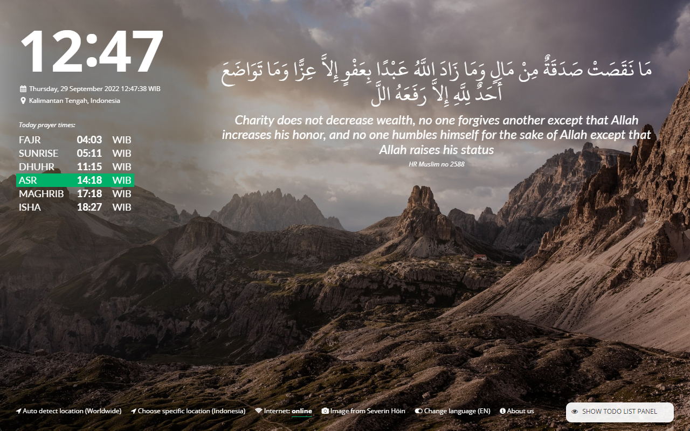

# Muslim Board

Personal Dashboard for Muslims in Indonesia.

Muslim Board is a personal dashboard for Muslims. This plugin is inspired by Momentum. For now, we only support Bahasa Indonesia.

## Table of Content

- Folder `extension` is where the chrome extension source code lies.
- Folder `resources` contains a few resource files (it's used by the extension or website directly).
- Folder `webservices` contains the backend serverless code (GCP function).
- Folder `website` contains the source code web/landing page, https://muslimboard.novalagung.com.

## Contribution

Anyone is allowed to contribute to this project. Bug fixes, improvements, feature requests, you name it!

However, before we start doing anything, especially on stuff within the `extension` folder, please keep in mind that:

- First, you need to understand how browser extensions work.
- Browser addons marketplaces have strict rules over a lot of things! Not every cool tech or approach is allowed, especially if it could bring vulnerability risk (from a security perspective).

    - External requests are strictly monitored and controlled. See the `content_security_policy` field on `manifest.json`.
    - This is one reason why libraries such as `jQuery` and `font-awesome` are physically copied to the source code.
    - It would be nice to have some cutting-edge technology applied here, but if it's resulting in rejection during submission, well ... I will not approve it.
    - I suggest opening a discussion/issue first, before doing any PRs, except if it's about code refactoring or bug fixing.

- Performance aspect is one primary key point in the development of Muslim Board.

    - Muslim Board extension needs to work well across many computers, any browsers, on any condition: slow internet, offline mode, low-spec computer, etc.
    - Certain images are loaded locally. These images will bring a performance boost during the initial load and also it's very useful when offline mode (no internet).

- To contribute, simply fork → commit your changes → submit PR.
- Navigate to `CONTRIBUTING.md` if you want to see the list of names who maintain and contribute to this project.

## Local Installation

Use chrome → open up extension menu → click **Load unpacked** and navigate to the `extension` directory. Another browser has a similar way to load unpacked extensions.

## Web Service

We use GCP Function to host our serverless backend, it's publicly accessible on https://asia-southeast2-muslim-board-ind-1472876095243.cloudfunctions.net.

## Author

Noval Agung Prayogo
